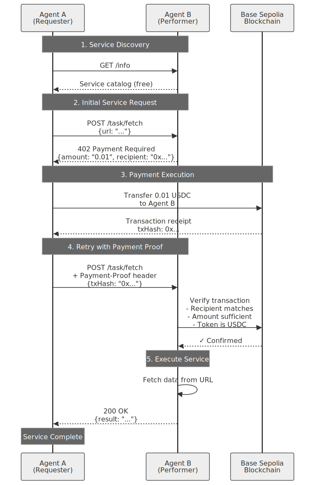

# IMMEDIATE NEXT STEPS
**Priority:** CRITICAL  
**Time Needed:** 1-2 hours  
**Blocking:** All other Phase 2 tasks  

---

## 🚨 CURRENT STATUS

**Build Status:** ❌ FAILING (11 TypeScript errors)  
**Diagrams:** ✅ GENERATED  
**Dependencies:** ✅ INSTALLED  
**Documentation:** ✅ COMPLETE  

**BLOCKER:** Cannot run agents or tests until type errors are fixed.

---

## 🔧 FIX THESE 11 ERRORS NOW

### Error 1-2: Network Format (EASY FIX - 5 minutes)

**File:** `src/agent-a-requester.ts` line 55  
**Error:** `Type 'string' not assignable to '${string}:${string}'`

**Fix:**
```typescript
// BEFORE
network: process.env.NETWORK_ID!,

// AFTER  
network: `evm:${process.env.NETWORK_ID}` as `${string}:${string}`,
```

**File:** `src/agent-b-performer.ts` line 89  
**Error:** Same network type issue in routes config

**Fix:** Update all network references to use `"evm:84532"` format

---

### Error 3-7: Response Typing (EASY FIX - 10 minutes)

**Files:** `agent-a-requester.ts` (lines 82-85), `test/e2e-test.ts` (lines 67-72)  
**Error:** `Property 'X' does not exist on type 'unknown'`

**Fix:** Add type interfaces

```typescript
// Add at top of agent-a-requester.ts
interface ServiceInfo {
  agent: string;
  services: Array<{
    name: string;
    endpoint: string;
    price: string;
    description: string;
  }>;
}

// Line 82-85: Replace
const info: unknown = response.data;
console.log('Agent:', info.agent);
console.log('Services:', info.services.length);
console.table(info.services);

// With:
const info = response.data as ServiceInfo;
console.log('Agent:', info.agent);
console.log('Services:', info.services.length);
console.table(info.services);
```

Do similar fixes in `test/e2e-test.ts`

---

### Error 8: viem API (MODERATE FIX - 15 minutes)

**File:** `src/agent-a-requester.ts` line 48  
**Error:** `Property 'getBalance' does not exist`

**Fix:** Check viem documentation for correct API

**Option A:** Use publicClient
```typescript
// Instead of:
const balance = await walletClient.getBalance({ address: wallet.address });

// Try:
import { createPublicClient, http } from 'viem';

const publicClient = createPublicClient({
  chain: baseSepolia,
  transport: http()
});

const balance = await publicClient.getBalance({ 
  address: wallet.address 
});
```

**Option B:** Comment out for now (balance check is for logging only)
```typescript
// const balance = await walletClient.getBalance({ address: wallet.address });
// console.log('Wallet balance:', balance);
console.log('Wallet address:', wallet.address);
```

---

### Error 9-10: x402 API (MODERATE FIX - 20 minutes)

**File:** `src/agent-b-performer.ts` lines 107, 127  
**Error:** Methods don't exist: `createPaymentRequiredResponse`, `verifyAndSettlePayment`

**Fix:** Check @x402/core documentation

**Quick check:**
```bash
# See what's exported
npm list @x402/core @x402/express

# Check type definitions
cat node_modules/@x402/core/dist/esm/server/index.d.mts | grep -A5 "class.*Server"
cat node_modules/@x402/express/dist/esm/index.d.mts | grep -A5 "export"
```

**Likely fixes:**
```typescript
// Line 107: Instead of
const response = server.createPaymentRequiredResponse(routes);

// Try:
const response = server.createPaymentRequired(routes);
// OR: The middleware might handle this automatically

// Line 127: Instead of  
const settlement = await server.verifyAndSettlePayment(proof, config);

// Try:
const settlement = await server.verifyPayment(proof, config);
// OR: Check if there's a separate 'settle' method
```

---

### Error 11: Same as Error 9-10

See fixes above.

---

## ✅ VERIFICATION STEPS

After fixing errors:

```bash
cd projects/usdc-hackathon-submission

# 1. Build must succeed
npm run build
# Expected: 0 errors ✅

# 2. Check what was built
ls -la dist/
# Expected: .js files for agent-a-requester, agent-b-performer, test

# 3. Try running agents (will fail without .env, but should not crash)
npm run agent-b -- --help
# Expected: Usage message or "Missing .env" (not type errors)

# 4. If all good, proceed to testnet validation
# Follow: TESTNET-VALIDATION.md
```

---

## 🚀 AFTER FIXES - FOLLOW THIS ORDER

### 1. Add Diagrams to README (5 minutes)

```bash
# Open README.md and find the Architecture section
# Add these lines:



```

### 2. Testnet Validation (1-2 hours)

```bash
# Open guide
open TESTNET-VALIDATION.md

# Key actions:
# - Get 2 wallets
# - Fund with Base Sepolia ETH + USDC
# - Create .env file
# - Run agents and document TX hashes
```

### 3. GitHub Repository (1 hour)

```bash
# Open guide  
open GITHUB-SETUP.md

# Key actions:
# - Initialize git
# - Create GitHub repo
# - Push code
# - Configure settings
```

### 4. Demo Video (2-3 hours)

```bash
# Open guide
open DEMO-VIDEO-SCRIPT.md

# Key actions:
# - Record 6 segments
# - Edit and upload
# - Add link to README
```

### 5. Final Submission (1 hour)

```bash
# Open checklist
open SUBMISSION-CHECKLIST.md

# Key actions:
# - Update SUBMISSION.md
# - Final proofread
# - Submit to OpenClaw
```

---

## 📊 TIME BUDGET

| Task | Time | Status |
|------|------|--------|
| Fix type errors | 1-2h | ⏳ NOW |
| Add diagrams to README | 5min | ⏳ AFTER |
| Testnet validation | 1-2h | ⏳ AFTER |
| Demo video | 2-3h | ⏳ AFTER |
| GitHub repository | 1h | ⏳ AFTER |
| Final submission | 1h | ⏳ AFTER |

**Total:** 6-10 hours  
**Deadline:** Feb 8, 12:00 PM PST (2.5 days)  
**Status:** ✅ ACHIEVABLE

---

## 💡 DEBUGGING TIPS

### If stuck on type errors:

**1. Check package versions:**
```bash
npm list @x402/core @x402/express @x402/fetch @x402/evm viem
```

**2. Look for examples:**
```bash
# Check if there are example files in node_modules
find node_modules/@x402 -name "*.example.*" -o -name "*.test.*"
```

**3. Read type definitions:**
```bash
# See what's actually exported
cat node_modules/@x402/core/dist/esm/server/index.d.mts
cat node_modules/@x402/express/dist/esm/index.d.mts
```

**4. Temporary workaround:**
```typescript
// If really stuck, use 'any' temporarily to unblock
const response = (server as any).createPaymentRequiredResponse(routes);
```

**5. Check GitHub issues:**
- x402 repo: https://github.com/coinbase/x402
- viem repo: https://github.com/wevm/viem

---

## 🎯 SUCCESS CRITERIA

**Before moving to next task:**
- ✅ `npm run build` completes with 0 errors
- ✅ No red underlines in IDE
- ✅ `dist/` folder contains compiled .js files
- ✅ Agents can be imported without errors

**Don't proceed to testnet validation until build is clean!**

---

## 📞 NEED HELP?

**All fixes above should work. If still stuck after 2 hours:**

1. Document what you tried
2. Note which specific errors remain
3. Consider:
   - Commenting out problematic features temporarily
   - Using simplified implementations
   - Reaching out to OpenClaw Discord for x402 help

**Remember:** Core logic is likely correct, just type mismatches. Be patient and methodical.

---

## 🚀 YOU'VE GOT THIS!

**The hard part (implementation) is done.**  
**These are just TypeScript type issues.**  
**Follow the fixes above and you'll be back on track in 1-2 hours.**

**Then:** Smooth sailing through testnet → video → GitHub → submission! 🎉

---

**Start here:** Fix Error 1-2 (network format) - easiest win!  
**Next:** Fix Error 3-7 (response typing) - add interfaces  
**Then:** Fix Error 8-11 (API methods) - check docs  
**Finally:** Build, verify, and proceed to testnet! ✅
