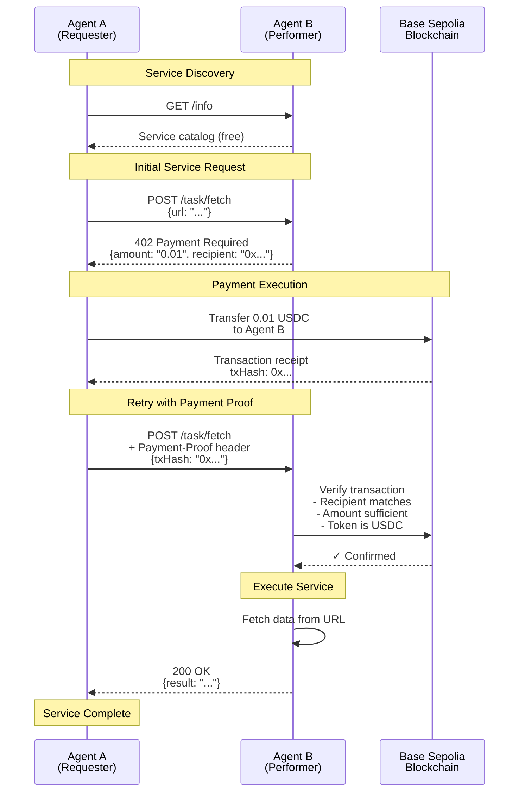
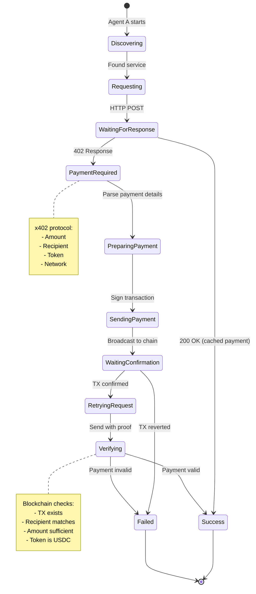
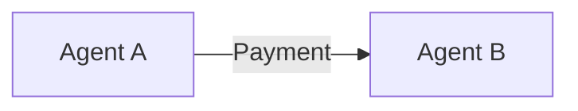

# Architecture Diagrams

This directory contains visual representations of the system architecture.

## Files

- `payment-flow.svg` - Complete payment flow sequence
- `architecture-overview.svg` - High-level system architecture
- `component-diagram.svg` - Component relationships

These can be generated using mermaid.js or created manually using tools like:
- draw.io (https://app.diagrams.net/)
- Excalidraw (https://excalidraw.com/)
- Mermaid Live Editor (https://mermaid.live/)

## Mermaid Source

The diagrams below can be rendered at https://mermaid.live/

### Payment Flow Sequence



### Architecture Overview

```mermaid
graph TB
    subgraph "Agent A (Requester)"
        A1[CLI Interface]
        A2[@x402/fetch Client]
        A3[Wallet<br/>viem]
        A4[Payment Logic]
    end
    
    subgraph "Agent B (Performer)"
        B1[Express Server]
        B2[@x402/express Middleware]
        B3[Payment Verifier]
        B4[Service Handlers]
        B5[Data Fetch Service<br/>$0.01]
        B6[Computation Service<br/>$0.05]
        B7[Content Gen Service<br/>$0.10]
    end
    
    subgraph "Blockchain Infrastructure"
        C1[Base Sepolia<br/>L2 Network]
        C2[USDC Contract<br/>0x036CbD53842c5426634e7929541eC2318f3dCF7e]
        C3[RPC Node<br/>sepolia.base.org]
    end
    
    subgraph "x402 Infrastructure"
        D1[x402 Protocol]
        D2[Coinbase Facilitator<br/>x402.coinbase.com]
    end
    
    A1 --> A2
    A2 --> A4
    A4 --> A3
    A3 -.USDC Transfer.-> C2
    C2 --> C1
    A2 -.HTTP + x402.-> B1
    B1 --> B2
    B2 --> B3
    B3 -.Verify Payment.-> C3
    C3 --> C1
    B2 --> B4
    B4 --> B5
    B4 --> B6
    B4 --> B7
    A2 -.Payment Protocol.-> D1
    B2 -.Payment Protocol.-> D1
    D1 --> D2
    
    style A1 fill:#e1f5ff
    style B1 fill:#fff4e1
    style C1 fill:#f0e1ff
    style D1 fill:#e1ffe1
```

### Component Interaction

```mermaid
graph LR
    subgraph "Request Flow"
        R1[User Command] --> R2[Agent A CLI]
        R2 --> R3[x402 Fetch]
        R3 --> R4[HTTP Request]
    end
    
    subgraph "Payment Flow"
        P1[402 Response] --> P2[Payment Handler]
        P2 --> P3[Wallet Sign]
        P3 --> P4[Blockchain TX]
        P4 --> P5[TX Receipt]
        P5 --> P6[Retry Request]
    end
    
    subgraph "Verification Flow"
        V1[Payment Proof] --> V2[x402 Middleware]
        V2 --> V3[Blockchain Query]
        V3 --> V4[Validate TX]
        V4 --> V5[Execute Service]
    end
    
    R4 --> P1
    P6 --> V1
    
    style R1 fill:#e1f5ff
    style P2 fill:#ffe1e1
    style V4 fill:#e1ffe1
```



### State Machine: Payment Protocol



## How to Use These Diagrams

### Option 1: Mermaid Live Editor
1. Go to https://mermaid.live/
2. Copy the mermaid code above
3. Paste into the editor
4. Export as SVG or PNG

### Option 2: Include in Markdown
GitHub automatically renders mermaid diagrams in markdown:

```markdown

```

### Option 3: Command Line
```bash
# Install mermaid CLI
npm install -g @mermaid-js/mermaid-cli

# Convert to SVG
mmdc -i diagram.mmd -o diagram.svg
```
